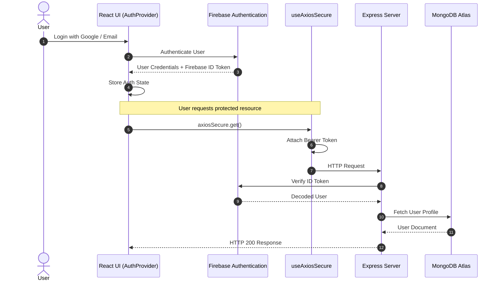
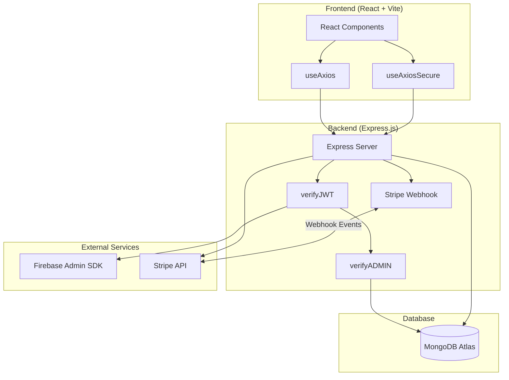

# System Architecture

This document explains the internal architecture, request lifecycle, authentication flow, middleware pipeline, and communication between the frontend, backend, database, and third-party services used in the **Digital Life Lessons Platform**.

---

# Table of Contents

- [Architecture Overview](#architecture-overview)
- [End-to-End Request Lifecycle](#end-to-end-request-lifecycle)
  - [Frontend Network Flow](#1-frontend-network-flow)
  - [Routing & Gateway Flow](#2-routing--gateway-flow)
  - [Express Middleware Chain](#3-express-middleware-chain)
- [Authentication & Session Handshake](#authentication--session-handshake)
- [Application Architecture Pipeline](#application-architecture-pipeline)

---

# Architecture Overview

The Digital Life Lessons Platform follows a **decoupled full-stack architecture**, where the frontend and backend operate independently while communicating through a REST API.

The application consists of four major layers:

- **Frontend (React + Vite)**
- **Backend (Express.js)**
- **Database (MongoDB Atlas)**
- **External Services (Firebase Authentication & Stripe)**

Overall request flow:

```text
React Client
      │
      ▼
Axios / Axios Secure
      │
      ▼
Express Server
      │
      ▼
MongoDB Atlas

External Services
    ├── Firebase Authentication
    └── Stripe Payment Gateway
```

---

# End-to-End Request Lifecycle

The following sections describe how requests travel through the application.

---

## 1. Frontend Network Flow

### Public Requests

Public API requests are handled using the custom **useAxios** hook.

Responsibilities:

- Uses the application's base API URL.
- Sends requests without authentication headers.
- Accesses public API endpoints.

---

### Authenticated Requests

Protected API requests are handled using **useAxiosSecure**.

Responsibilities:

- Retrieves the authenticated Firebase ID Token.
- Automatically injects the JWT into every protected request.
- Sends the Authorization header in the following format:

```http
Authorization: Bearer <firebase_id_token>
```

---

### Session Expiration

If the backend responds with either:

- **401 Unauthorized**
- **403 Forbidden**

the Axios response interceptor automatically:

- Logs the current user out
- Clears authentication state
- Redirects the user to `/login`

This ensures expired or invalid sessions cannot continue accessing protected resources.

---

## 2. Routing & Gateway Flow

### Client-Side Routing

Application routing is managed using **React Router**.

Main layouts include:

- RootLayout
- AuthLayout
- Dashboard

Protected pages are wrapped with:

- `PrivateRoute`
- `AdminRoute`

---

### Backend Gateway

All HTTP requests enter the backend through:

```
server/index.js
```

Request flow:

```
Incoming Request
        │
        ▼
Express Router
        │
        ├── Public Routes
        │
        └── Protected Routes
                │
                ▼
           verifyJWT
                │
                ▼
          verifyADMIN
                │
                ▼
          Route Controller
                │
                ▼
             MongoDB
```

---

## 3. Express Middleware Chain

Every protected request follows the middleware pipeline below.

### 1. CORS Middleware

Responsibilities:

- Validates allowed origins
- Enables credentials
- Prevents unauthorized cross-origin requests

---

### 2. Stripe Webhook

The webhook endpoint is registered **before** `express.json()`.

This allows Stripe signature verification using the raw request body.

```javascript
express.raw({ type: "application/json" })
```

---

### 3. JSON Body Parser

```javascript
express.json()
```

Responsibilities:

- Parses incoming JSON payloads
- Makes request data available through `req.body`

---

### 4. Authentication Middleware (`verifyJWT`)

Responsibilities:

- Reads the Authorization header
- Extracts the Bearer Token
- Verifies it using Firebase Admin SDK
- Stores the decoded email inside:

```javascript
req.tokenEmail
```

---

### 5. Authorization Middleware (`verifyADMIN`)

Responsibilities:

- Retrieves the authenticated user
- Verifies that the user's role is `admin`
- Rejects unauthorized requests with **403 Forbidden**

---

# Authentication & Session Handshake

The following sequence illustrates the authentication lifecycle between the client and server.



---

# Application Architecture Pipeline

The following diagram illustrates the overall communication between application components.



---

# Architecture Summary

The Digital Life Lessons Platform adopts a modern, scalable client-server architecture.

### Frontend Responsibilities

- User Interface Rendering
- Client-side Routing
- Authentication State Management
- API Communication
- Protected Route Handling

---

### Backend Responsibilities

- REST API
- Business Logic
- Authentication
- Authorization
- Payment Processing
- Database Operations

---

### Database

MongoDB Atlas provides:

- Persistent Storage
- Aggregation Pipelines
- Indexing
- Query Execution

---

### External Services

#### Firebase Authentication

Responsible for:

- User Authentication
- JWT Generation
- Token Verification

#### Stripe

Responsible for:

- Payment Processing
- Checkout Sessions
- Webhook Events
- Premium Membership Activation

---

# Related Documentation

- 📁 `PROJECT_STRUCTURE.md` — Monorepo layout and folder responsibilities.
- ⚙️ `SETUP.md` — Installation, environment variables, and local development.
- 🧩 `FEATURES.md` — Authentication, RBAC, search, filtering, and Stripe implementation.
- 🚀 `DEPLOYMENT.md` — Docker, GitHub Actions, and production deployment.